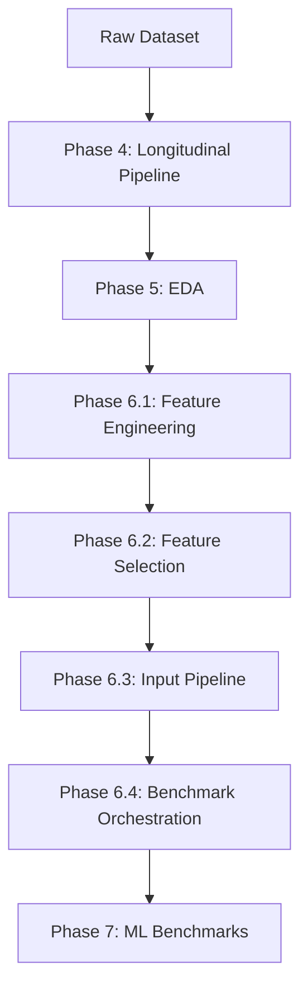

# System Architecture

```mermaid
graph TD;
    A[Raw Dataset] --> B[Phase 4: Longitudinal Pipeline]
    B --> C[Phase 5: EDA]
    C --> D[Phase 6.1: Feature Engineering]
    D --> E[Phase 6.2: Feature Selection]
    E --> F[Phase 6.3: Input Pipeline]
    F --> G[Phase 6.4: Benchmark Orchestration]
    G --> H[Phase 7: ML Benchmarks]
```
