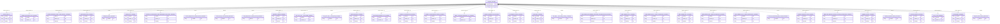

# Dataset Relationships

## ER Diagram

```mermaid
erDiagram
    MASTER_COHORT {
        string PATNO PK
        string EVENT_ID PK
    }
    MASTER_COHORT ||--o{ clinical_cohort_v1 : "PATNO, EVENT_ID"
    clinical_cohort_v1 {
        string PATNO FK
        string EVENT_ID FK
        string INFODT FK
    }
    MASTER_COHORT ||--o{ FOUND_Self_Reported_Dx_14Jul2026 : "PATNO, EVENT_ID"
    FOUND_Self_Reported_Dx_14Jul2026 {
        string PATNO FK
        string EVENT_ID FK
    }
    MASTER_COHORT ||--o{ Geriatric_Depression_Scale__Short_Version__14Jul2026 : "PATNO, EVENT_ID"
    Geriatric_Depression_Scale__Short_Version__14Jul2026 {
        string PATNO FK
        string EVENT_ID FK
        string INFODT FK
    }
    MASTER_COHORT ||--o{ Neurological_Exam_14Jul2026 : "PATNO, EVENT_ID"
    Neurological_Exam_14Jul2026 {
        string PATNO FK
        string EVENT_ID FK
        string INFODT FK
    }
    MASTER_COHORT ||--o| Participant_Status_08Jul2026 : "PATNO"
    Participant_Status_08Jul2026 {
        string PATNO FK
    }
    MASTER_COHORT ||--o{ SCOPA_AUT_14Jul2026 : "PATNO, EVENT_ID"
    SCOPA_AUT_14Jul2026 {
        string PATNO FK
        string EVENT_ID FK
        string INFODT FK
    }
    MASTER_COHORT ||--o{ University_of_Pennsylvania_Smell_Identification_Test_UPSIT_14Jul2026 : "PATNO, EVENT_ID"
    University_of_Pennsylvania_Smell_Identification_Test_UPSIT_14Jul2026 {
        string PATNO FK
        string EVENT_ID FK
        string INFODT FK
    }
    MASTER_COHORT ||--o| Current_Biospecimen_Analysis_Results_08Jul2026 : "PATNO"
    Current_Biospecimen_Analysis_Results_08Jul2026 {
        string PATNO FK
    }
    MASTER_COHORT ||--o| Kinetic_data_for_SAA_Results_08Jul2026 : "PATNO"
    Kinetic_data_for_SAA_Results_08Jul2026 {
        string PATNO FK
    }
    MASTER_COHORT ||--o| SAA_Biospecimen_Analysis_Results_08Jul2026 : "PATNO"
    SAA_Biospecimen_Analysis_Results_08Jul2026 {
        string PATNO FK
    }
    MASTER_COHORT ||--o{ Dopamine_Imaging_14Jul2026 : "PATNO, EVENT_ID"
    Dopamine_Imaging_14Jul2026 {
        string PATNO FK
        string EVENT_ID FK
        string INFODT FK
    }
    MASTER_COHORT ||--o{ Xing_Core_Lab___Quant_SBR_14Jul2026 : "PATNO, EVENT_ID"
    Xing_Core_Lab___Quant_SBR_14Jul2026 {
        string PATNO FK
        string EVENT_ID FK
    }
    MASTER_COHORT ||--o| Xing_Core_Lab___Visual_Read_14Jul2026 : "PATNO"
    Xing_Core_Lab___Visual_Read_14Jul2026 {
        string PATNO FK
    }
    MASTER_COHORT ||--o{ Clinical_Diagnosis_14Jul2026 : "PATNO, EVENT_ID"
    Clinical_Diagnosis_14Jul2026 {
        string PATNO FK
        string EVENT_ID FK
        string INFODT FK
    }
    MASTER_COHORT ||--o{ Concomitant_Medication_Log_14Jul2026 : "PATNO, EVENT_ID"
    Concomitant_Medication_Log_14Jul2026 {
        string PATNO FK
        string EVENT_ID FK
    }
    MASTER_COHORT ||--o{ Features_of_Parkinsonism_14Jul2026 : "PATNO, EVENT_ID"
    Features_of_Parkinsonism_14Jul2026 {
        string PATNO FK
        string EVENT_ID FK
        string INFODT FK
    }
    MASTER_COHORT ||--o{ Initiation_of_Dopaminergic_Therapy_14Jul2026 : "PATNO, EVENT_ID"
    Initiation_of_Dopaminergic_Therapy_14Jul2026 {
        string PATNO FK
        string EVENT_ID FK
        string INFODT FK
    }
    MASTER_COHORT ||--o{ LEDD_Concomitant_Medication_Log_14Jul2026 : "PATNO, EVENT_ID"
    LEDD_Concomitant_Medication_Log_14Jul2026 {
        string PATNO FK
        string EVENT_ID FK
    }
    MASTER_COHORT ||--o{ Medical_Conditions_Log_14Jul2026 : "PATNO, EVENT_ID"
    Medical_Conditions_Log_14Jul2026 {
        string PATNO FK
        string EVENT_ID FK
        string INFODT FK
    }
    MASTER_COHORT ||--o{ PD_Diagnosis_History_14Jul2026 : "PATNO, EVENT_ID"
    PD_Diagnosis_History_14Jul2026 {
        string PATNO FK
        string EVENT_ID FK
        string INFODT FK
    }
    MASTER_COHORT ||--o{ Vital_Signs_14Jul2026 : "PATNO, EVENT_ID"
    Vital_Signs_14Jul2026 {
        string PATNO FK
        string EVENT_ID FK
        string INFODT FK
    }
    MASTER_COHORT ||--o| Gait_Data___Arm_swing__Axivity__14Jul2026 : "PATNO"
    Gait_Data___Arm_swing__Axivity__14Jul2026 {
        string PATNO FK
    }
    MASTER_COHORT ||--o{ Gait_Substudy_Gait_Mobility_Assessment_and_Measurement_14Jul2026 : "PATNO, EVENT_ID"
    Gait_Substudy_Gait_Mobility_Assessment_and_Measurement_14Jul2026 {
        string PATNO FK
        string EVENT_ID FK
        string INFODT FK
    }
    MASTER_COHORT ||--o{ MDS_UPDRS_Part_III_14Jul2026 : "PATNO, EVENT_ID"
    MDS_UPDRS_Part_III_14Jul2026 {
        string PATNO FK
        string EVENT_ID FK
        string INFODT FK
    }
    MASTER_COHORT ||--o{ MDS_UPDRS_Part_IV__Motor_Complications_14Jul2026 : "PATNO, EVENT_ID"
    MDS_UPDRS_Part_IV__Motor_Complications_14Jul2026 {
        string PATNO FK
        string EVENT_ID FK
        string INFODT FK
    }
    MASTER_COHORT ||--o{ MDS_UPDRS_Part_I_14Jul2026 : "PATNO, EVENT_ID"
    MDS_UPDRS_Part_I_14Jul2026 {
        string PATNO FK
        string EVENT_ID FK
        string INFODT FK
    }
    MASTER_COHORT ||--o{ MDS_UPDRS_Part_I_Patient_Questionnaire_14Jul2026 : "PATNO, EVENT_ID"
    MDS_UPDRS_Part_I_Patient_Questionnaire_14Jul2026 {
        string PATNO FK
        string EVENT_ID FK
        string INFODT FK
    }
    MASTER_COHORT ||--o{ MDS_UPDRS_Part_II__Patient_Questionnaire_14Jul2026 : "PATNO, EVENT_ID"
    MDS_UPDRS_Part_II__Patient_Questionnaire_14Jul2026 {
        string PATNO FK
        string EVENT_ID FK
        string INFODT FK
    }
    MASTER_COHORT ||--o| Roche_PD_Monitoring_App_v2_data_14Jul2026 : "PATNO"
    Roche_PD_Monitoring_App_v2_data_14Jul2026 {
        string PATNO FK
    }
    MASTER_COHORT ||--o{ Epworth_Sleepiness_Scale_14Jul2026 : "PATNO, EVENT_ID"
    Epworth_Sleepiness_Scale_14Jul2026 {
        string PATNO FK
        string EVENT_ID FK
        string INFODT FK
    }
    MASTER_COHORT ||--o{ REM_Sleep_Behavior_Disorder_Screening_Questionnaire_14Jul2026 : "PATNO, EVENT_ID"
    REM_Sleep_Behavior_Disorder_Screening_Questionnaire_14Jul2026 {
        string PATNO FK
        string EVENT_ID FK
        string INFODT FK
    }
    MASTER_COHORT ||--o{ Eligibility_Override_14Jul2026 : "PATNO, EVENT_ID"
    Eligibility_Override_14Jul2026 {
        string PATNO FK
        string EVENT_ID FK
        string INFODT FK
    }
    MASTER_COHORT ||--o| FOUND_Enrollment_Status_14Jul2026 : "PATNO"
    FOUND_Enrollment_Status_14Jul2026 {
        string PATNO FK
    }
    MASTER_COHORT ||--o{ Inclusion_Exclusion_14Jul2026 : "PATNO, EVENT_ID"
    Inclusion_Exclusion_14Jul2026 {
        string PATNO FK
        string EVENT_ID FK
        string INFODT FK
    }
    MASTER_COHORT ||--o{ Age_at_visit_08Jul2026 : "PATNO, EVENT_ID"
    Age_at_visit_08Jul2026 {
        string PATNO FK
        string EVENT_ID FK
    }
    MASTER_COHORT ||--o{ Demographics_08Jul2026 : "PATNO, EVENT_ID"
    Demographics_08Jul2026 {
        string PATNO FK
        string EVENT_ID FK
        string INFODT FK
    }
    MASTER_COHORT ||--o| Subject_Cohort_History_08Jul2026 : "PATNO"
    Subject_Cohort_History_08Jul2026 {
        string PATNO FK
    }
```